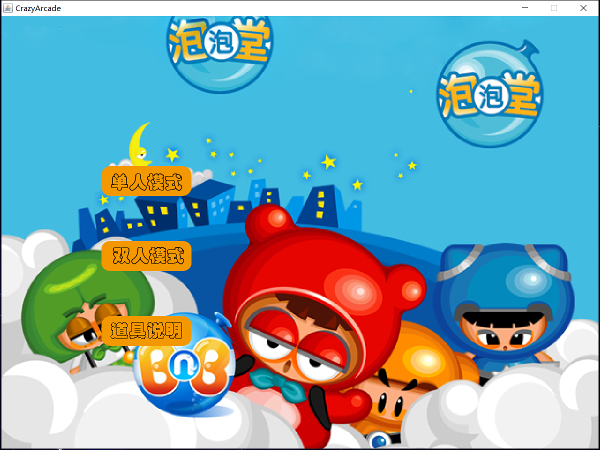
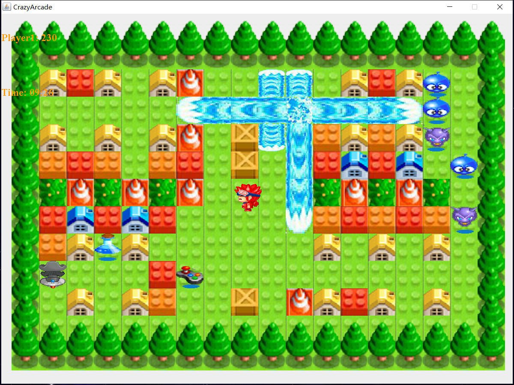

# CrazyArcade
> `CrazyArcade`泡泡堂游戏，一款用Java编写的`JavaSwing游戏程序`。
使用了`MVC模式`，分离了模型、视图和控制器，使得项目结构清晰易于扩展，使用配置文件来设置游戏基本配置，扩展地图人物道具等。同时，该程序编写期间用了单例模式、工厂模式、模板模式等设计模式。为了游戏的可玩性，我们特意设计了[平滑碰撞](##平滑碰撞)以及[机器人](##机器人)。

---
# 示例图片
[所有示例图片](./EXAMPLE/SCREENSHOT/)

---
# 项目介绍
## 项目结构
* frame：包含如开始、游戏中、结束的JFrame
* main：包含程序入口和其它游戏控制
* model：
    * model.loader：包含资源加载器用于读取配置文件等信息，使用了单例设计模式
    * model.manager：包含元素管理器、工厂等，用于控制游戏各元素
    * model.vo：各种实体类，包括玩家、NPC、炸弹、方块等等
* pro：配置文件目录，包含人物、道具、地图、方块、游戏设置等配置文件
* thread：配合游戏一起执行的各种线程，如音乐、键盘监听、游戏控制等
* utiil：工具包

## 机器人
为了尽量复原泡泡堂游戏，我们初步实现了机器人功能。该机器人可以判断障碍物释放炸弹、规避炸弹、攻击玩家。目前该机器人仍存在一些小问题，比如某些情况会卡住不动
## 平滑碰撞
人物在拐角处移动的时候经常不是刚好对齐的状态，程序会判定玩家碰撞了障碍物所以导致玩家无法拐弯。所以我们在处理这种情况的时候，会让玩家进行平滑的移动使得玩家看上去是滑进去的，增强玩家游戏体验
## 其它特性
- [x] 音乐
- [x] 使用配置文件扩展游戏
- [x] 道具
- [x] 单/双人模式
- [ ] 显示玩家和机器人状态（道具等）

---
# 使用
## 打包文件
如果您仅是想试玩该泡泡堂游戏，那么可以选择以下方式获得打包文件夹，并执行其中的`CrazyArcade.jar`文件
> 注意：无论您使用哪种方式，在运行程序之前请确保您安装了**JRE环境**

* [下载最新版文件](https://github.com/SCNU-A225/CrazyArcade/releases)，并解压缩
* 克隆或下载该项目，打开RELEASE->DIST文件夹
## 项目文件
如果您是想获取该项目源代码进行参考、学习或者修改，可以按以下步骤进行

1. 使用git克隆或直接下载该项目
2. 使用`Eclipse`等导入该Java项目
3. 由于编译使用的Java版本可能不一致，如果提示错误请根据您电脑的环境修改项目配置
4. 编译并运行`GameStart.java`游戏入口文件

## 改善该项目
1. 提出[Issues](https://github.com/SCNU-A225/CrazyArcade/issues)，告知我们
2. 创建[Pull requests](https://github.com/SCNU-A225/CrazyArcade/pulls)

---
# 更新
更新记录，以及各版本查看[Release页面](https://github.com/SCNU-A225/CrazyArcade/releases)

# 声明
该项目是练习项目，没有参与任何商业行为。

**若该项目侵权请务必通知我们删除该项目！**

# 许可
[Apache License 2.0](https://github.com/SCNU-A225/CrazyArcade/blob/master/LICENSE)

